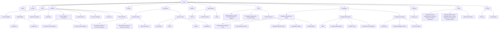

```mermaid
graph TD
    A[Home] --> B[About]
    A --> C[Contact]
    A --> D[FAQ]
    A --> E[Features]
    E --> E1[Account Updater]
    E --> E2[Digital Wallets]
    E2 --> E21[Apple Pay]
    E2 --> E22[Google Pay]
    E --> E3[QR Code Payments]
    E --> E4[Reporting]
    E --> E5[Secure Payment Processing]
    E5 --> E51[3D Secure for Ecommerce]
    E5 --> E52[Point-to-Point Encryption]
    E --> E6[Fraud Protection]
    E --> E7[Free Cost Analysis]
    E --> E8[Use Cases]
    E --> E9[Virtual Terminal]
    A --> F[Pricing]
    A --> G[Resources]
    G --> G1[Resource Items]
    G1 --> G11[The impact of P2PE on PCI DSS compliance]
    G1 --> G12[The Star Tribune relies on the power of Payway]
    G1 --> G13[...More Resources...]
    G --> G2[Resource Tags]
    G2 --> G21[Case Study]
    G2 --> G22[Ebook]
    G2 --> G23[Videos]
    G2 --> G24[Whitepaper]
    A --> H[Support]
    A --> I[Why Payway]
    I --> I1[Service]
    I --> I2[Cost-Plus Pricing]
    I --> I3[Setup]
    A --> J[Blog]
    J --> J1[Advanced tech is a must for new generation of workers]
    J --> J2[Charitable organizations save with Payway]
    J --> J3[...More Blog Posts...]
    A --> K[Developers]
    K --> K1[Developer Overview and Terms]
    K1 --> K11[PaywayWS and Payment Terms]
    K1 --> K12[General Payment Terms]
    K1 --> K13[PaywayWS Specific Terms]
    K1 --> K14[PaywayWS Features]
    K1 --> K15[Getting Started]
    K --> K2[Payway Admin Guide]
    K2 --> K21[Setup]
    K2 --> K22[Company Administrators]
    K2 --> K23[Regular Users]
    K2 --> K24[Permissions and Privileges]
    K --> K3[Payway Users Guide]
    K3 --> K31[Introduction]
    K3 --> K32[Payment Manager Tool Bar]
    K3 --> K33[ACH Processing]
    A --> L[Partners]
    L --> L1[Partners List]
    A --> M[News]
    M --> M1[Payway announces partnership with the Retail Solutions Providers Association]
    M --> M2[Payway unveils new API PaywayWS built to simplify payment processing and increase security]
    M --> M3[...More News Articles...]
    A --> N[Promos]
    N --> N1[Promos]
    N --> N2[Why Payway]
```
